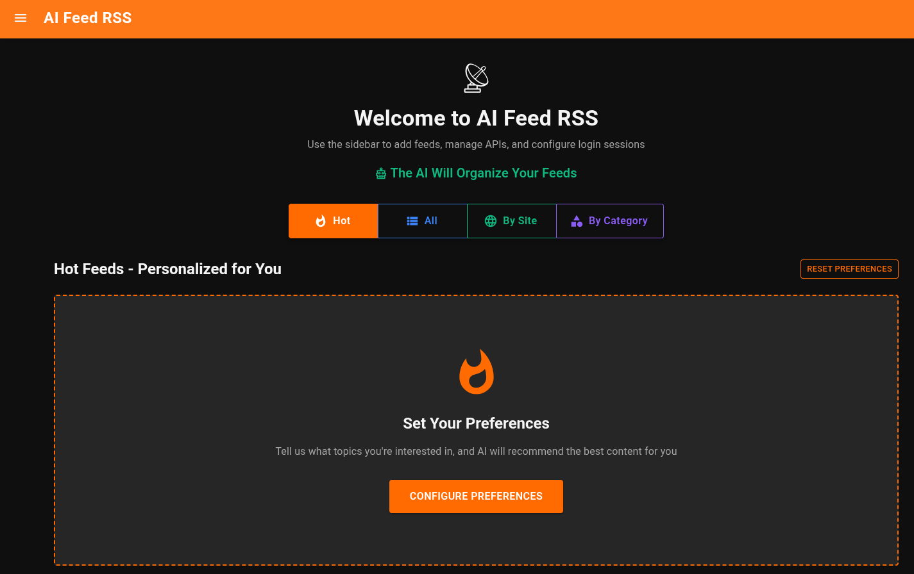
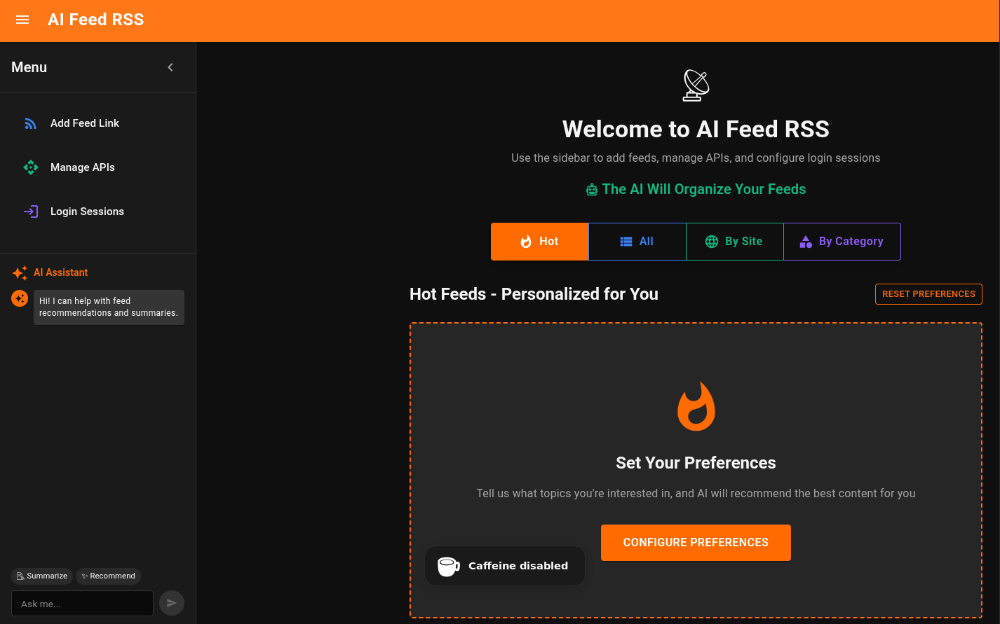

# AI FeedRSS

> **⚠️ STILL IN DEVELOPMENT** 🚧  
> This application is actively being developed. Features may be incomplete or subject to change.

**Built with**: AI for syntax | Human for logic | Learning clean, scalable code  
All repos public to show my evolution as a developer 📈

---

## Overview

AI FeedRSS is an intelligent RSS feed aggregator with AI-powered chat assistance. The application provides a modern, dark-themed interface for managing multiple RSS feeds, viewing articles, and interacting with AI assistants to get content recommendations and summaries.

## Screenshots

### Main Dashboard


### AI Chat Interface


## Features

### 🤖 AI-Powered Chat Assistant
- **Multi-Provider Support**: Integrates with OpenAI (GPT-4), Google Gemini, Anthropic Claude, and Perplexity AI
- **Context-Aware Responses**: AI understands your feeds and provides relevant recommendations
- **Article Search**: Ask questions about your feed content and get intelligent answers
- **Chat History**: Persistent conversation history with clear option

### � RSS Feed Management
- **Single & Bulk Import**: Add one feed or multiple feeds at once via URL list
- **Auto-Detection**: Automatically detects feed names and item counts
- **CORS Proxy**: Backend proxy handles RSS fetching to bypass browser restrictions
- **Article Viewer**: View all articles from a feed in a dedicated modal
- **Search & Filter**: Search articles by title/description

### � Smart Dashboard Views
- **Hot Feeds**: View feeds matching your interest preferences
- **All Feeds**: Browse all your subscribed feeds
- **By Site**: Filter feeds grouped by source website
- **By Category**: AI-organized category filtering (coming soon)

### 🎨 Modern UI/UX
- **Dark Theme**: Comfortable dark mode interface (#0f0f0f background)
- **Orange Accents**: Vibrant orange (#f59e0b) highlights and interactive elements
- **Retractable Sidebar**: Clean navigation with Dashboard, Feed Management, API Management, Login Sessions, and Config
- **Responsive Design**: Material-UI components optimized for all screen sizes

## 🚀 Quick Start

### Prerequisites
- Docker and Docker Compose
- Git
- At least one AI API key (OpenAI, Google Gemini, Anthropic, or Perplexity)

### Installation

1. **Clone the repository**
   ```bash
   git clone https://github.com/abner-dos-reis/ai-feed-rss.git
   cd ai-feed-rss
   ```

2. **Set up environment**
   ```bash
   make install  # Creates .env file from template
   # Edit .env file with your configuration
   ```

3. **Start development environment**
   ```bash
   make dev  # Builds and starts all services
   ```

4. **Configure AI APIs**
   - Open the application at http://localhost:7200
   - Click on "Manage APIs" in the sidebar
   - Add your API keys for any supported provider (OpenAI, Gemini, Claude, or Perplexity)

5. **Add RSS Feeds**
   - Click "Add Feed" in the sidebar
   - Enter a single RSS feed URL or bulk import multiple URLs
   - The system will auto-detect feed names and item counts

### Services and Ports

- **Frontend**: http://localhost:7200 (React.js with Material-UI)
- **Backend API**: http://localhost:7201 (FastAPI with RSS proxy)
- **Nginx Proxy**: http://localhost:7204 (Reverse proxy)
- **Database**: localhost:7202 (PostgreSQL)
- **Redis**: localhost:7203 (Cache layer)

### Available Commands

```bash
make help          # Show all available commands
make up            # Start all services
make down          # Stop all services
make logs          # Show logs from all services
make db-shell      # Connect to database
make test          # Run all tests
make clean         # Clean up Docker resources
```

## Technology Stack

### Backend
- **FastAPI**: Modern Python web framework with async support
- **PostgreSQL**: Relational database for persistent storage
- **Redis**: Cache layer for session management
- **httpx**: Async HTTP client for RSS fetching
- **CORS Middleware**: Handles cross-origin requests

### Frontend
- **React 18**: Modern React with hooks
- **Material-UI (MUI)**: Comprehensive UI component library
- **localStorage**: Client-side persistence for feeds, articles, and API keys
- **Fetch API**: Native HTTP requests to backend

### AI Integration
- **OpenAI GPT-4o-mini**: Fast, cost-effective language model
- **Google Gemini 1.5 Flash**: Google's latest multimodal AI
- **Anthropic Claude 3 Haiku**: Compact, efficient Claude model
- **Perplexity AI**: Llama 3.1 Sonar with online search capabilities

### DevOps
- **Docker**: Containerized services
- **Docker Compose**: Multi-container orchestration
- **Nginx**: Reverse proxy and load balancer
- **Makefile**: Simplified development workflow

## Development

### Project Structure
```
ai-feed-rss/
├── backend/              # FastAPI backend
│   ├── main.py          # Main application with RSS proxy endpoint
│   ├── Dockerfile       # Optimized with COPY --chown
│   └── requirements.txt # Python dependencies
├── frontend/            # React.js frontend
│   ├── src/
│   │   ├── components/  # UI components
│   │   │   ├── Dashboard.js         # Main feed dashboard (4 views)
│   │   │   ├── Sidebar.js           # Navigation + AI chat
│   │   │   ├── AddFeedModal.js      # Single/bulk feed import
│   │   │   ├── FeedArticlesModal.js # Article viewer with search
│   │   │   ├── ManageAPIsModal.js   # API key management
│   │   │   ├── LoginSessionsModal.js# Session management
│   │   │   └── ConfigModal.js       # Configuration (placeholder)
│   │   ├── App.js       # Main app component
│   │   └── index.js     # Entry point
│   ├── Dockerfile       # Optimized build
│   └── package.json     # Node dependencies
├── database/            # PostgreSQL init scripts
├── nginx/               # Nginx reverse proxy config
├── public/              # Screenshots and assets
├── docker-compose.yml   # 5-service orchestration
├── Makefile            # Development commands
├── .env.example        # Environment template
└── README.md           # This file
```

### Component Architecture

**Dashboard.js** (542 lines)
- Four filter views: Hot, All, By Site, By Category
- Feed cards with active status, item count badges, and "Check" buttons
- Opens FeedArticlesModal when clicking Check button
- Stores feeds in localStorage['feeds']

**Sidebar.js** (491 lines)
- Retractable navigation menu with 5 items
- Integrated AI chat with message history
- Supports 4 AI providers with automatic fallback
- System prompt focused on content curation
- Chat history stored in component state

**AddFeedModal.js** (365+ lines)
- Tab 1: Single feed import with auto-detection
- Tab 2: Bulk import from multiple URLs
- RSS proxy integration for CORS handling
- Auto-saves successful feeds to localStorage
- Shows success/error results for bulk imports

**FeedArticlesModal.js** (350 lines)
- Loads articles via RSS proxy endpoint
- Merges new articles with stored articles
- Search functionality by title/description
- AI search with article context
- Persistent storage in localStorage['feedArticles']

**ManageAPIsModal.js**
- Manages API keys for 4 providers
- Stores keys in localStorage['aiApiKeys']
- Validates key format before saving
- Masked display with show/hide toggle

### Backend API Endpoints

**POST /api/rss-proxy**
- Fetches RSS feeds server-side to bypass CORS
- Request: `{ "url": "https://example.com/feed.xml" }`
- Response: XML content with CORS headers
- Uses httpx.AsyncClient with 30s timeout
- Custom User-Agent: 'Mozilla/5.0 (compatible; AI-Feed-RSS/1.0)'

## 📄 License

This project is licensed under the MIT License - see the [LICENSE](LICENSE) file for details.
